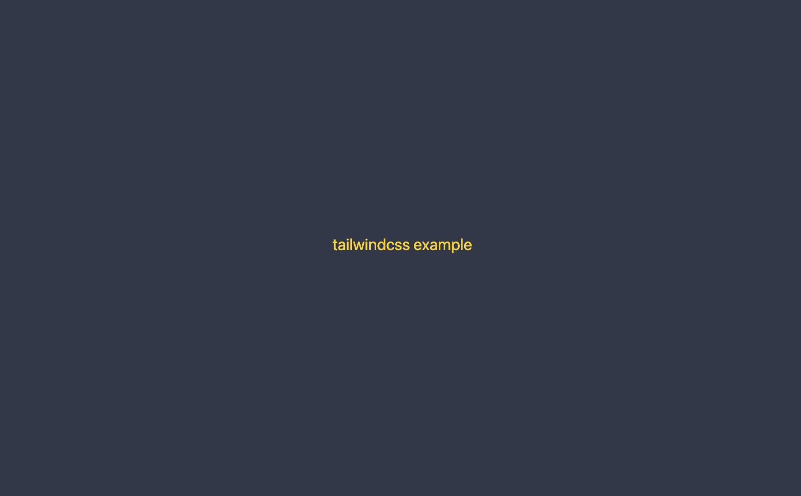

当我看到 [Tailwindcss](https://tailwindcss.com/) 时，首先联想到是 [Bootstrap](https://getbootstrap.com/)。

使用过 Bootstrap 的人都知道，虽然可以使页面快速成型，但是 Bootstrap 本身存在巨大的限制，就是页面的风格被固定住了。使得扩展非常不方便。

所以大多数人选择使用 Less 或 Sass 这样 CSS 预处理器来提高效率。但始终无法避免代码的堆积，同时造成页面风格不统一。

究其根本就是因为没有*设计约束*。

## 解决的问题

Tailwindcss 使用的 `utility-first` 理念解决了以上问题同时还带来了诸多好处。

- 不需要为了类名纠结
- CSS 的输出大小在可控范围内，项目到一定规模后大小几乎是不变的，因为类名高度复用
- 统一的行为和高度的自定义能力
- 能很容易地实现响应式设计和主题切换，例如暗黑模式

自从 Tailwindcss 发布 2.1 后，携带了一个重大的更新就是 JIT mode。即时编译（just-in-time）的能力可以按需编译和加载 CSS。

它使 Tailwindcss 解锁了各种各样能力。首先带来的好处就是编译时的速度提升。

## 环境搭建

下面使用使用一个简易的 Vite cli 搭建开发环境。你也使用任何社区流行的脚手架，请参阅 Tailwindcss [安装](https://tailwindcss.com/docs/installation)

```sh
yarn create @vitejs/app tailwindcss-quick-start --template react-ts
```

安装 Tailwindcss 和 postcss

```sh
yarn add -D tailwindcss@latest postcss@latest autoprefixer@latest
```

生成配置文件

```sh
npx tailwindcss init -p
```

这时会生成 postcss.config.js 和 tailwind.config.js 两个文件

将 `purge` 修改一下

```js
// tailwind.config.js
module.exports = {
_  purge: [],
+  purge: ['./index.html', './src/**/*.{vue,js,ts,jsx,tsx}'],
  darkMode: false, // or 'media' or 'class'
  theme: {
    extend: {},
  },
  variants: {
    extend: {},
  },
  plugins: [],
};
```

在 src/index.css 内包含 tailwindcss 的内部样式

```css
@tailwind base;
@tailwind components;
@tailwind utilities;
```

```tsx
// src/main.tsx
import React from 'react';
import ReactDOM from 'react-dom';
import './index.css';
import App from './App';

ReactDOM.render(
  <React.StrictMode>
    <App />
  </React.StrictMode>,
  document.getElementById('root')
);
```

在 App.tsx 中写入测试代码

```tsx
<div className='h-screen grid place-content-center text-3xl bg-gray-700 text-yellow-300'>
  <span className='hover:text-red-500'>tailwindcss example</span>
</div>
```

保存之后就可以看到

鼠标移到到文字会切换到红色



使用 VS Code 开发时可以安装 Tailwind CSS IntelliSense, 可以在编辑器内查看到编译后的样式。
